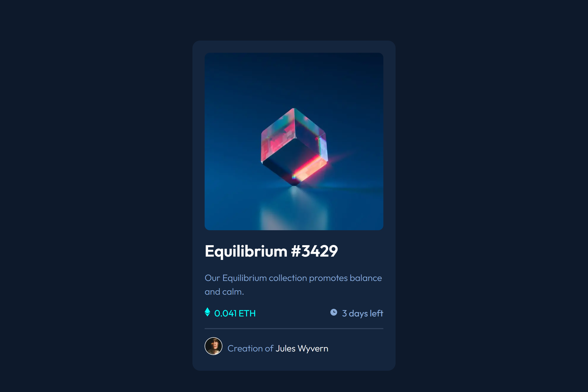

# Frontend Mentor - NFT preview card component solution

This is a solution to the [NFT preview card component challenge on Frontend Mentor](https://www.frontendmentor.io/challenges/nft-preview-card-component-SbdUL_w0U). Frontend Mentor challenges help you improve your coding skills by building realistic projects.

## Table of contents

-   [Overview](#overview)
    -   [The challenge](#the-challenge)
    -   [Screenshot](#screenshot)
    -   [Links](#links)
-   [My process](#my-process)
    -   [Built with](#built-with)
    -   [What I learned](#what-i-learned)
-   [Author](#author)

## Overview

### The challenge

Users should be able to:

-   View the optimal layout depending on their device's screen size
-   See hover states for interactive elements

### Screenshot

### Links

-   Solution URL: [Solution URL](https://github.com/Andro87/nft-preview-card-component.git)
-   Live Site URL: [Live site URL](https://nft-preview-card-component-roan-alpha.vercel.app/)

## My process

### Built with

-   Semantic HTML5 markup
-   Sass - Scss
-   Flexbox
-   CSS Grid
-   Mobile-first workflow
-   [React](https://reactjs.org/) - JS library
-   [Next.js](https://nextjs.org/) - React framework

### What I learned

I used this project as part of the "Advanced CSS techniques" learning path on the Frontend Mentor platform to practice the CUBE CSS methodology created by Andy Bell.
While working on this project, my major struggles were related to understanding the principles of this methodology and efficiently applying them.
I'm looking forward to expanding my knowledge and learning how to adapt it to larger projects.

## Author

-   Frontend Mentor - [@Andro87](https://www.frontendmentor.io/profile/Andro87)
